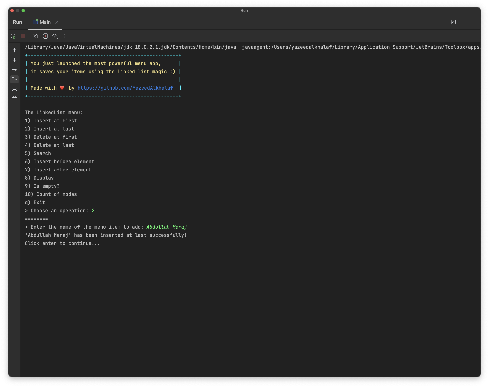

# Assignment 1

Implement the app as a menu, a cli app:

1. `insertAtFirst`
2. `insertAtLast`
3. `deleteAtFirst`
4. `deleteAtLast`
5. `search`
6. `insertBeforeElement`
7. `insertAfterElement`
8. `display`
9. `isEmpty`
10. `countOfNodes`
11. `exit`: exit the cli app.

> Deadline: Thursday 16/11/2023 at 11:59pm

## Screenshots of some operations 📸

| Initial                                  | Wrong Input                                | Quit                               |
| ---------------------------------------- | ------------------------------------------ | ---------------------------------- |
|  |  |  |

| insertAtFirst                                            | insertAtLast                                           | Display                                  |
| -------------------------------------------------------- | ------------------------------------------------------ | ---------------------------------------- |
|  |  |  |

